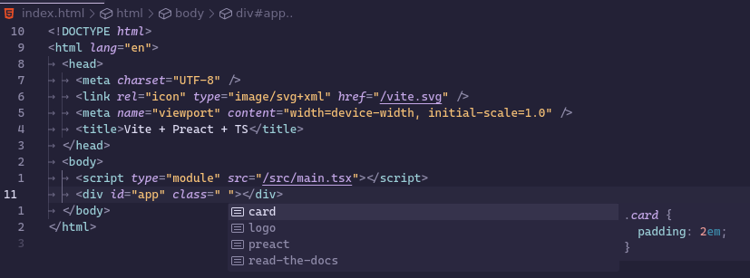

## Features

Let Dotzie, the pixel pilot, be your guide! Hand them any CSS files in your workspace, and they'll offer autocompletion based on the classnames.

In order to have class names appear in your autocomplete list, you must first add the CSS files you want autocompletion for by right-clicking the file and pressing "Add CSS file to autocomplete".

## Extension Settings

This extension contributes the following settings:

- `css-to-go.filesList`: The list of CSS files that will have their classes made available for autocompletion. Autocomplete will only be provided for files within the workspace you currently have open.
- `css-to-go.htmlLanguages`: A list of HTML-based languages where suggestions are enabled.
- `css-to-go.javascriptLanguages`: A list of JavaScript-based languages where suggestions are enabled.

## Known Issues

None so far.

## [Release Notes](https://github.com/martypenner/css-to-go/blob/main/vscode-extension/CHANGELOG.md)
